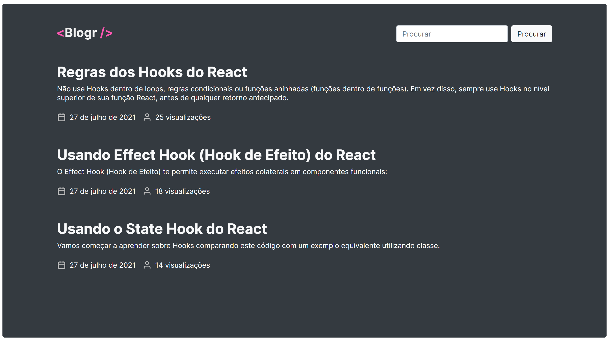

<p align="center">
  
</p>

<p align="center">
	  
	  
	  
	  
	  <a href="https://blogr-dev.vercel.app">
			
    </a>
</p>

<p align="center">
  <b>Next.js statically generated blog</b>
</p>

<p align="center">
  
</p>

## 🛠 Technologies

### Frontend

- [React](https://reactjs.org)
- [Next.js](https://nextjs.org/)
- [TypeScript](https://www.typescriptlang.org/)
- [Bootstrap](https://getbootstrap.com/)
- [Sass](https://sass-lang.com/)

### Backend

- [Node.js](https://nodejs.org/en/)
- [TypeScript](https://www.typescriptlang.org/)
- [Express](https://expressjs.com/pt-br/)
- [MongoDB](https://www.mongodb.com/)
- [Prismic](https://prismic.io/)

## 👨‍💻 Contributing

1. Fork it (<https://github.com/mpirescarvalho/blogr/fork>)
2. Create your feature branch (`git checkout -b feature/awesome`)
3. Commit your changes (`git commit -am 'Add awesome feature'`)
4. Push to the branch (`git push origin feature/awesome`)
5. Create a new Pull Request

## 🚀 Building

You'll need [Node.js](https://nodejs.org) installed on your computer in order to build this app.

Clone the repository:

```bash
$ git clone https://github.com/mpirescarvalho/blogr.git
$ cd blogr
```

---

### Backend

To run the backend, you'll need a working MongoDB instance. You can use [MongoDB Atlas](https://www.mongodb.com/cloud/atlas) or install it locally.
Go to `backend` folder and create a `.env` file using `.env.template` as example.

Now you can proceed to run the backend.
Inside `backend` folder:

```bash
$ npm install
$ npm run dev
```

Runs the server in the development mode.<br/>

---

### Frontend

To run the frontend, go to `frontend` folder and create a `.env` file using `.env.template` as example. If you ran the backend in the previous step, your api url will be `localhost:3333`.env

Now you can proceed to run the frontend.
Inside `frontend` folder:

```bash
$ npm install
$ npm run dev
```

Runs the web app in the development mode.<br/>

---

## ✉ Contact

<a href="https://github.com/mpirescarvalho">
  
</a>
<a href="mailto:mpirescarvalho17@gmail.com">
  
</a>
